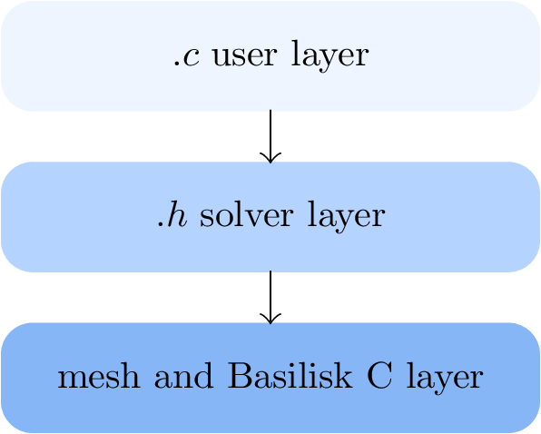
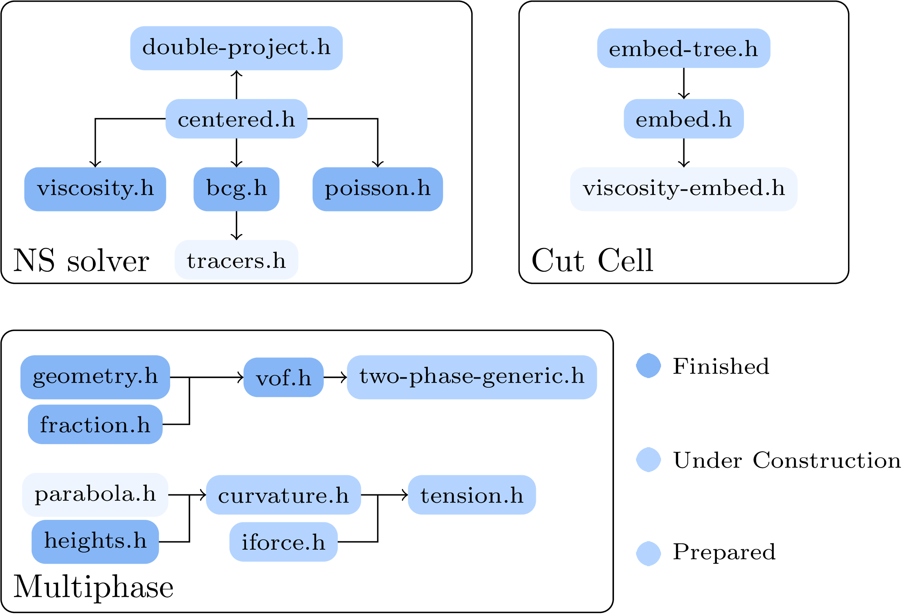

# Basilisk Documentation
This is a Documentation for PDE solver [Basilisk](http://basilisk.fr/) written by Haochen Huang, a master candidate in XJTU.

The doc is written for those who are interested in how things work inside Basilisk and want to alter the solver.

<figure>
   
  
  <figcaption>
  </figcaption>
     
</figure>

For those interested in the algorithm, a clear introduction is available in the [Basilisk-Doc](./Basilisk-Doc.pdf). For more detailed information on the overall programming workflow, refer to this [directory](./pdfoutput/).

# For Real What is [Basilisk](http://basilisk.fr/)?
**Technically, Basilisk consists of two parts.**

Unlike most open-source solvers, which usually consist of a collection of header files designed for specific types of PDEs in Fortran, C, or C++, Basilisk features a [Domain Specific Language (DSL)](https://en.wikipedia.org/wiki/Domain-specific_language) called BasiliskC. For users familiar with Basilisk simulations, the installation process involves generating *qcc*, a [transpiler](https://en.wikipedia.org/wiki/Source-to-source_compiler#:~:text=A%20source%2Dto%2Dsource%20translator,or%20a%20different%20programming%20language.) (or preprocessor) provided by Basilisk that translates BasiliskC into standard C99 for compilation with *gcc*. This design ensures the versatility of Basilisk: as long as your machine has *gcc*, you can run Basilisk seamlessly. Additionally, a key component of Basilisk is its mesh management, which is deeply integrated with *qcc*. This allows for efficient iteration over multigrid and tree grid structures, freeing solver developers from tedious tasks like manual memory allocation and MPI compatibility, so they can focus on high-level solver development.

Based on our previous discussions, coherent documentation for Basilisk should include two main components. The first part consists of the header files, including the PDE solver (such as [centered.h](./pdfoutput/centered-h.pdf) and [poisson.h](./pdfoutput/poisson-h.pdf)), which represent the physical core of the overall solver. The second part encompasses the low-level components (the preprocessor and mesh configuration), which embody the spirit of Basilisk.

# Plan
## Header File
### Incompressible solver 
- [] centered solver
	- [] [centered.h](./pdfoutput/centered-h.pdf)
	- [] [double-projection.h](./pdfoutput/double-projection-h.pdf)
		- [x] [viscosity.h](./pdfoutput/viscosity-h.pdf)
		- [x] [poisson.h](./pdfoutput/poisson-h.pdf)
		- [x] [bcg.h](./pdfoutput/bcg-h.pdf)

- [] VOF multiphase solver
	- [] two-phase-levelset.h
		- [] redistance.h
	- [] two-phase-clsvof.h
		- [] tracer.h
	- [] two-phase.h
		- [] two-phase-generic.h
		- [x] [vof.h](./pdfoutput/vof-h.pdf)
			- [] fractions.h
			- [] geometry.h
			- [] myc.h & myc2d.h
	- [] iforce.h
		- [] curvature.h
			- [] [heights.h](./pdfoutput/heights-h.pdf)
			- [] parabola.h

- [] solid embed boundary
	- [] embed.h and everything associated in other headfile
	- [] [embed-tree.h](./pdfoutput/embed-tree-h.pdf)

<figure>
   
  
  <figcaption>
  </figcaption>
     
</figure>

### Compressible solver
- [] compressible

### Grid
- [] grid/tree.h
- [] grid/tree-common.h
- [] grid/mempool.h
- [] grid/memindex/range.h

## Compiler
- [] ast

## Introduction to the `.cls` File

A custom `.cls` file has been created as a template for this documentation. To use it, simply declare `\documentclass{BasiliskD}` in your LaTeX source. The class supports three customizable options:

- `single`: toggles between displaying the document as a single chapter or as a complete book.  
- `hidecode`: determines whether to hide code blocks and their corresponding explanations.  
- `bibpath`: specifies the exact path to the bibliography file.

With these settings, users can choose to read a concise algorithm-focused version in [book format](./Basilisk-Doc.pdf), where code blocks are omitted, or explore detailed documentation for each header file in the [output directory](./pdfoutput/), which includes the full code.  

If you'd like to create your own documentation, you can start from this [LaTeX example](./texfile/codeexample.tex) and compile it using the sequence: `PDFLaTeX → Biber → PDFLaTeX → PDFLaTeX`.

# Contact
[My sandbox](basilisk.fr/sandbox/HCH/README) and feel free to email me: dahuanghhc@gmail.com
