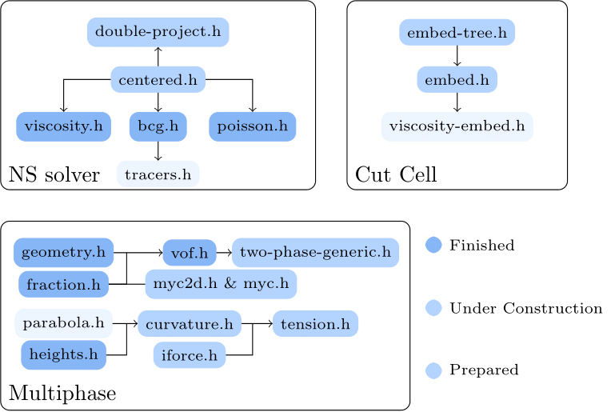

# Basilisk Documentation
This is a Documentation for PDE solver [Basilisk](http://basilisk.fr/) written by Haochen Huang, a master candidate in XJTU.

The doc is written for those who are interested in how things work inside Basilisk and want to alter the solver.

<figure>
   
  
  <figcaption>
  </figcaption>
     
</figure>

# For Real What is [Basilisk](http://basilisk.fr/)?
**Technically, Basilisk consists of two parts.**

Unlike most open-source solvers, which typically consist of a collection of header files designed to solve specific types of PDEs written in Fortran, C, or C++, Basilisk offers a [Domian Specific Language](https://en.wikipedia.org/wiki/Domain-specific_language) called BasiliskC. For those familiar with simulation using Basilisk, the [installation process](http://basilisk.fr/src/INSTALL) involves generating *qcc*, the [transpiler](https://en.wikipedia.org/wiki/Source-to-source_compiler#:~:text=A%20source%2Dto%2Dsource%20translator,or%20a%20different%20programming%20language.) provided by Basilisk which translates BasiliskC into standard C99 and compiles it with *gcc*. This ensures the generality of the Basilisk: as long as your mechine is equipped with *gcc*, you can run Basilisk on it. Yet another component forms the low-level of Basilisk is the mesh management.

The *qcc*, deeply integrated with tree mesh management, consist the *spirit* of Basilisk, and is the critical to free solver developer from tedious work such as manually memory allocation, MPI compatibility etc.

A coherent documentation for Basilisk should encompass two main components. The first part consists of the header files, which include the solver

# Plan
## Header File
### Incompressible solver 
- [] centered solver
	- [] centered.h
	- [] double-projection.h
		- [x] [viscosity.h](./viscosity.h-doc/viscosity_h_Documentation.pdf)
		- [x] [poisson.h](./poisson.h-doc/poisson_h_Documentation.pdf)
		- [x] [bcg.h](./bcg.h-doc/bcg_h_Documentation.pdf)

- [] VOF multiphase solver
	- [] two-phase-levelset.h
		- [] redistance.h
	- [] two-phase-clsvof.h
		- [] tracer.h
	- [] two-phase.h
		- [] two-phase-generic.h
		- [x] [vof.h](./vof.h-doc/vof_h_Documentation.pdf)
			- [] fractions.h
			- [] geometry.h
	- [] iforce.h
		- [] curvature.h
			- [] [heights.h](./heights.h-doc/heights_h_Documentation.pdf)
			- [] parabola.h

- [] solid embed boundary
	- [] embed.h and everything associated in other headfile
	- [] [embed-tree.h](./embed-tree.h-doc/embed_tree_h_Documentation.pdf)

<figure>
   
  
  <figcaption>
  </figcaption>
     
</figure>

### Compressible solver
- [] compressible

### Grid
- [] grid/tree.h
- [] grid/tree-common.h
- [] grid/mempool.h
- [] grid/memindex/range.h

## Compiler
- [] ast

# Contact
[My sandbox](basilisk.fr/sandbox/HCH/README) and feel free to email me: dahuanghhc@gmail.com
